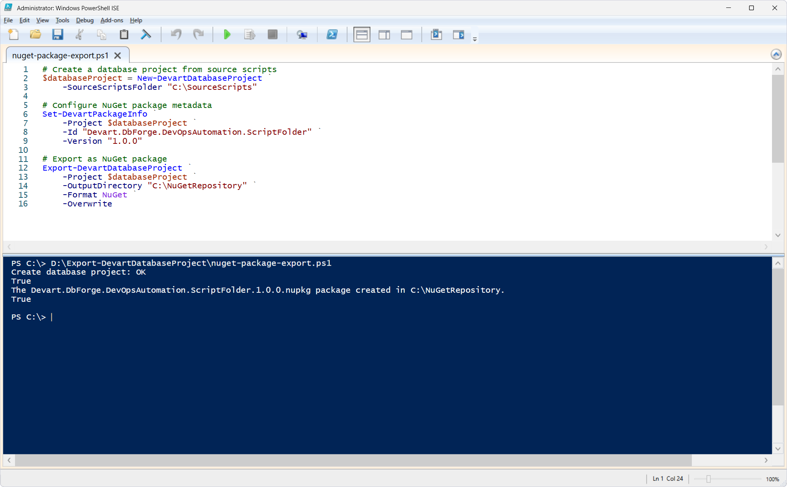
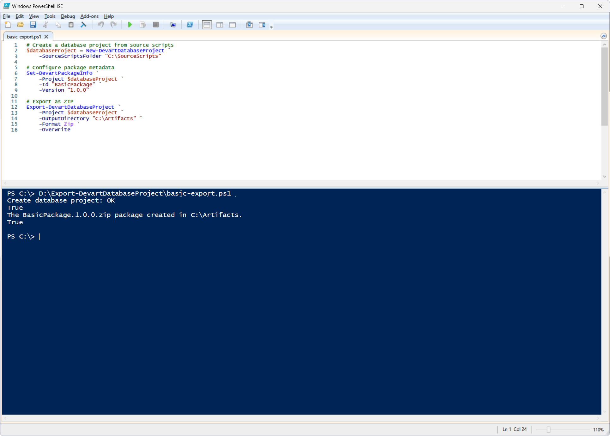

# Export-DevartDatabaseProject

The `Export-DevartDatabaseProject` cmdlet exports a database project created from source SQL scripts in a scripts folder in one of the supported formats: a NuGet package or a ZIP archive. Before exporting, create a database project object with the `New-DevartDatabaseProject` and configure package metadata with the `Set-DevartPackageInfo`.

The cmdlet can be used in DevOps processes to prepare build artifacts, publish packages, and automate CI/CD pipelines.

This cmdlet can be used in [dbForge Studio for SQL Server](https://www.devart.com/dbforge/sql/studio/) as well as in other database management environments.

## How to use

1. [Prepare a scripts folder](https://docs.devart.com/studio-for-sql-server/database-tasks/create-a-scripts-folder.html) with the SQL scripts of the AdventureWorks2025 database. This example uses the `C:\SourceScripts` folder.

2. Create a database project object using the `New-DevartDatabaseProject` cmdlet.

3. Configure package metadata using the `Set-DevartPackageInfo` cmdlet.

4. Run the corresponding script in PowerShell.

### Export to a NuGet package

PowerShell script: [`nuget-package-export.ps1`](nuget-package-export.ps1)

**Parameters:**

| Parameter | Required/Optional | Description |
| --- | --- | --- |
| `-SourceScriptsFolder` | Required | Path to the folder with the source SQL scripts (scripts folder); used in `New-DevartDatabaseProject` |
| `-Project` | Required | Database project object created with `New-DevartDatabaseProject`; used in `Set-DevartPackageInfo` and `Export-DevartDatabaseProject` |
| `-Id` | Required | Package identifier; used in `Set-DevartPackageInfo` |
| `-Version` | Optional | Package version; used in `Set-DevartPackageInfo` |
| `-OutputDirectory` | Required | Folder to save the export result to; used in `Export-DevartDatabaseProject` |
| `-Format NuGet` | Optional | Export format: NuGet package; used in `Export-DevartDatabaseProject` |
| `-Overwrite` | Optional | Overwriting of the existing package if present; used in `Export-DevartDatabaseProject` |

After successful execution, a NuGet package will be created in the specified folder.

### Export to a ZIP archive

PowerShell script: [`basic-export.ps1`](basic-export.ps1)

**Parameters:**

| Parameter | Required/Optional | Description |
| --- | --- | --- |
| `-SourceScriptsFolder` | Required | Path to the scripts folder; used in `New-DevartDatabaseProject` |
| `-Project` | Required | Database project object created with `New-DevartDatabaseProject`; used in `Set-DevartPackageInfo` and `Export-DevartDatabaseProject` |
| `-Id` | Required | Package identifier; used in `Set-DevartPackageInfo` |
| `-Version` | Required | Package version; used in `Set-DevartPackageInfo` |
| `-OutputDirectory` | Required | Folder to save the export result to; used in `Export-DevartDatabaseProject` |
| `-Format Zip` | Required | Export format: ZIP archive; used in `Export-DevartDatabaseProject` |
| `-Overwrite` | Optional | Overwriting of the existing archive if present; used in `Export-DevartDatabaseProject` |

After successful execution, a ZIP archive will be created in the specified folder.

## References

For more information, see the [official documentation](https://docs.devart.com/studio-for-sql-server/command-line-automation/devops-automation/powershell-cmdlets/export-devartdbproject.html).
