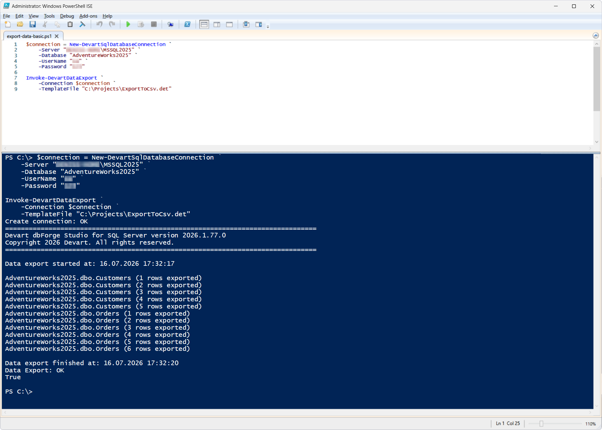
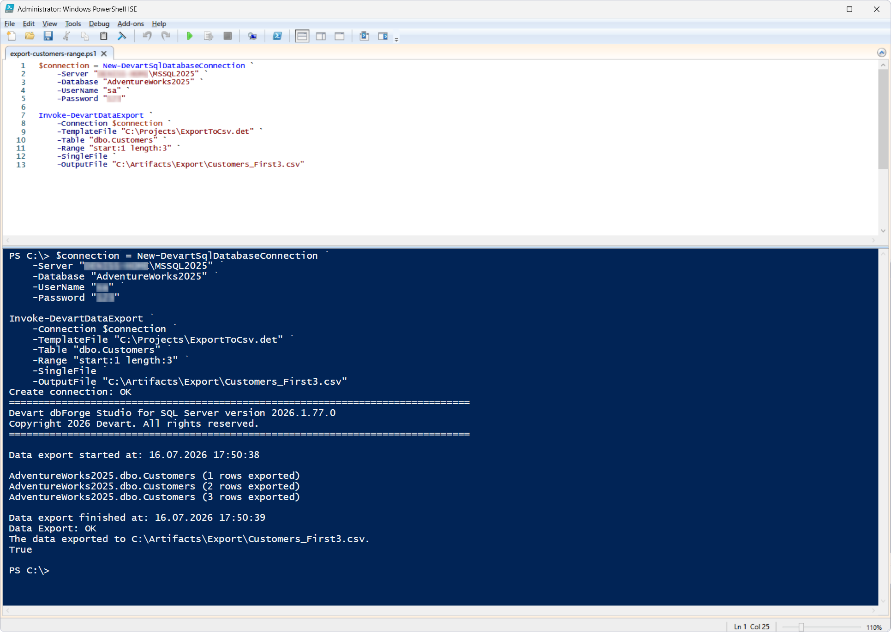

# Invoke-DevartDataExport

The `Invoke-DevartDataExport` cmdlet exports data from SQL Server in various file formats supported by dbForge.

Export settings (format, table list, column mapping, delimiters, encoding, and other parameters) are defined in an export template (`*.det`), which is created in advance in dbForge Data Pump for SQL Server or dbForge Studio for SQL Server. Individual template settings can be overridden during the cmdlet execution.

## Parameters

| Parameter | Required/Optional | Description |
| --- | --- | --- |
| `-TemplateFile` | Required | Path to the export template file (`*.det`) |
| `-Connection` | Required | SQL Server connection object created with `New-DevartSqlDatabaseConnection` or a connection string |
| `-OutputFile` | Optional | Path to the output file or folder to save the export results to |
| `-OutputTable` | Optional | Name of the output table |
| `-Range` | Optional | Range of rows to export defined as `start:<N> length:<M>` (e.g., "start:1 length:3" exports the first 3 rows)|
| `-SingleFile` | Optional | Export of the data of all selected tables into a single file |
| `-Table` | Optional | Name of one or several tables to export |

## How to use

> Before trying these examples, create an export template (`*.det`) in dbForge Data Pump for SQL Server or dbForge Studio for SQL Server. The examples below use the `ExportToCsv.det` template saved to `C:\Projects`.
This template is configured to:

> - Export the `dbo.Customers` and `dbo.Orders` tables
> - Export data in CSV format
> - Save files to the `C:\Artifacts\Export` folder

This cmdlet is illustrated with three scenarios.

Before executing the script, create and populate tables using the following SQL.
<details>
  <summary>Click to expand</summary>

```sql
USE AdventureWorks2025;
GO

DROP TABLE IF EXISTS dbo.ImportCustomers;
DROP TABLE IF EXISTS dbo.Orders;
DROP TABLE IF EXISTS dbo.Customers;
GO

------------------------------------------------------------
-- Customers
------------------------------------------------------------

CREATE TABLE dbo.Customers
(
CustomerID INT IDENTITY(1,1) PRIMARY KEY,
FirstName NVARCHAR(50) NOT NULL,
LastName NVARCHAR(50) NOT NULL,
Email NVARCHAR(100),
City NVARCHAR(50)
);
GO

INSERT INTO dbo.Customers
(
FirstName,
LastName,
Email,
City
)
VALUES
('John','Smith','john.smith@example.com','London'),
('Kate','Brown','kate.brown@example.com','Paris'),
('David','Wilson','david.wilson@example.com','Berlin'),
('Anna','Taylor','anna.taylor@example.com','Madrid'),
('Michael','Johnson','michael.johnson@example.com','Rome');
GO

------------------------------------------------------------
-- Orders
------------------------------------------------------------

CREATE TABLE dbo.Orders
(
OrderID INT IDENTITY(1001,1) PRIMARY KEY,
CustomerID INT NOT NULL,
OrderDate DATE NOT NULL,
TotalAmount DECIMAL(10,2) NOT NULL,
Status NVARCHAR(20) NOT NULL,

CONSTRAINT FK_Orders_Customers
FOREIGN KEY(CustomerID)
REFERENCES dbo.Customers(CustomerID)
);
GO

INSERT INTO dbo.Orders
(
CustomerID,
OrderDate,
TotalAmount,
Status
)
VALUES
(1,'2025-01-10',1250.00,'Completed'),
(1,'2025-02-12',180.50,'Completed'),
(2,'2025-02-15',420.00,'Processing'),
(3,'2025-03-01',89.99,'Completed'),
(4,'2025-03-18',310.25,'Cancelled'),
(5,'2025-04-05',999.00,'Completed');
GO

CREATE TABLE dbo.ImportCustomers
(
CustomerID INT NULL,
FirstName NVARCHAR(50) NULL,
LastName NVARCHAR(50) NULL,
Email NVARCHAR(100) NULL,
City NVARCHAR(50) NULL
);
GO
```
</details>

### Scenario 1: Export data using a template

This scenario demonstrates basic use of the cmdlet.

PowerShell script: [`export-data-basic.ps1`](export-data-basic.ps1)

As a result, data from the `dbo.Customers` and `dbo.Orders` tables is exported to the `Customers.csv` and `Orders.csv` files in the `C:\Artifacts\Export` folder, according to the settings in the `ExportToCsv.det` template. The output folder and file names are defined in the `ExportToCsv.det` template. If you need to override them, use the `-OutputFile` parameter (see Scenario 2).



### Scenario 2: Export the Customers table

This scenario demonstrates filtering the export to a single table and specifying a custom output file name.

PowerShell script: [`export-customers.ps1`](export-customers.ps1)

After the script execution, data from the `dbo.Customers` table is exported to `C:\Artifacts\Export\Customers.csv`.


### Scenario 3: Export a range of rows to a single file

This scenario demonstrates data export using the `-Range` and `-SingleFile` parameters.

PowerShell script: [`export-customers-range.ps1`](export-customers-range.ps1)

As a result of the script execution, the first three rows of the `dbo.Customers` table are exported to `C:\Artifacts\Export\Customers_First3.csv`.



## References

For more information, see the [official documentation](https://docs.devart.com/devops-automation-for-sql-server/powershell-cmdlets/invoke-devartdataexport.html).
