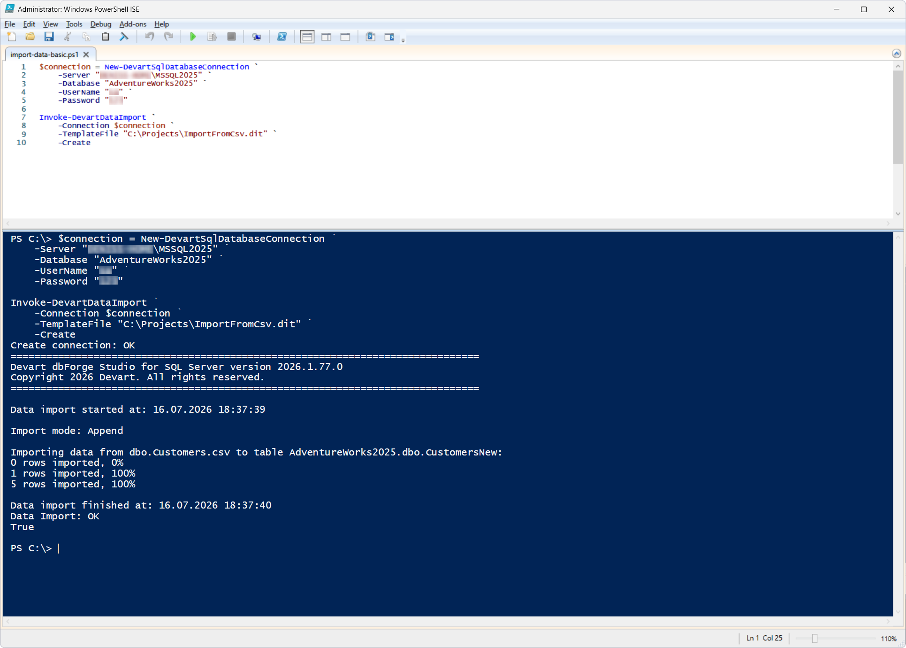
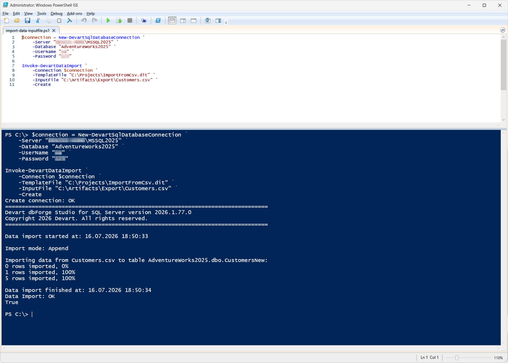
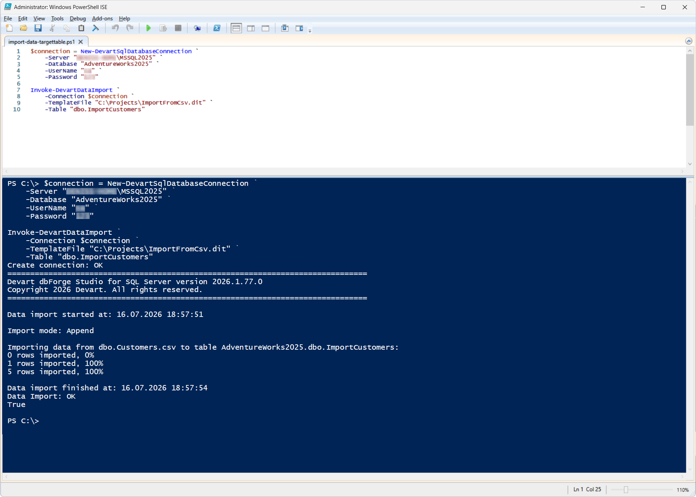

# Invoke-DevartDataImport

The `Invoke-DevartDataImport` cmdlet imports data from files into a SQL Server database.

Import settings (file format, column mapping, delimiters, encoding, and other parameters) are defined in an import template (`*.dit`), which is created in advance in the all-in-one AI-powered IDE [dbForge Studio for SQL Server](https://www.devart.com/dbforge/sql/studio/data-export-import.html) or the SSMS add-in [dbForge Data Pump for SQL Server](https://www.devart.com/dbforge/sql/data-pump/). Individual template settings can be overridden during the cmdlet execution.

## Parameters

| Parameter | Required/Optional | Description |
| --- | --- | --- |
| `-Connection` | Required | SQL Server connection object created with `New-DevartSqlDatabaseConnection` or a connection string |
| `-TemplateFile` | Required | Path to the import template file (`*.dit`) |
| `-Create` | Optional | Creates the target table before importing data. If not specified, the target table must already exist. |
| `-InputFile` | Optional | Path to the file containing the data to import |
| `-InputTable` | Optional | Name of the source table or view |
| `-Table` | Optional | Name of the SQL Server table the data will be imported into |

## How to use

> Before trying these examples, create an import template (`*.dit`) in dbForge Studio for SQL Server or dbForge Data Pump for SQL Server. The examples below use the `ImportFromCsv.dit` template saved to `C:\Projects`.
The template is configured to import data from a CSV file.

This cmdlet is illustrated with three scenarios.

### Scenario 1: Import data using a template

This scenario demonstrates the basic use of the cmdlet. The `-Create` switch instructs the cmdlet to create the target table according to the template settings before importing the data.

PowerShell script: [`import-data-basic.ps1`](import-data-basic.ps1)

After the script execution, a new table is created according to the settings of the `ImportFromCsv.dit` template, and then data is imported into it.



### Scenario 2: Import data using a different file

This scenario demonstrates using the `-InputFile` parameter to override the file specified in the template. The `-Create` switch instructs the cmdlet to create the target table according to the template settings before importing the data.

PowerShell script: [`import-data-inputfile.ps1`](import-data-inputfile.ps1)

As a result, the `Customers.csv` file specified during the cmdlet execution is used instead of the file saved in the template. A new table is created automatically, and then data is imported into it.



### Scenario 3: Import data with target table override

**Precondition:** use the following script to create a table into which data will be imported.

```sql
USE AdventureWorks2025;
GO
DROP TABLE IF EXISTS dbo.ImportCustomers;
GO

CREATE TABLE dbo.ImportCustomers
(
CustomerID INT NULL,
FirstName NVARCHAR(50) NULL,
LastName NVARCHAR(50) NULL,
Email NVARCHAR(100) NULL,
City NVARCHAR(50) NULL
);
GO
```

This scenario demonstrates using the `-Table` parameter to import data into the specified SQL Server table. In this scenario, the `-Create` switch is not used because the target table is created manually in the precondition step. If the target table does not exist and `-Create` is not specified, the import will fail.

PowerShell script: [`import-data-targettable.ps1`](import-data-targettable.ps1)

The data is imported into the `dbo.ImportCustomers` table specified during the cmdlet execution instead of the table defined in the template.



## References

For more information, see the [official documentation](https://docs.devart.com/devops-automation-for-sql-server/powershell-cmdlets/invoke-devartdataimport.html).
