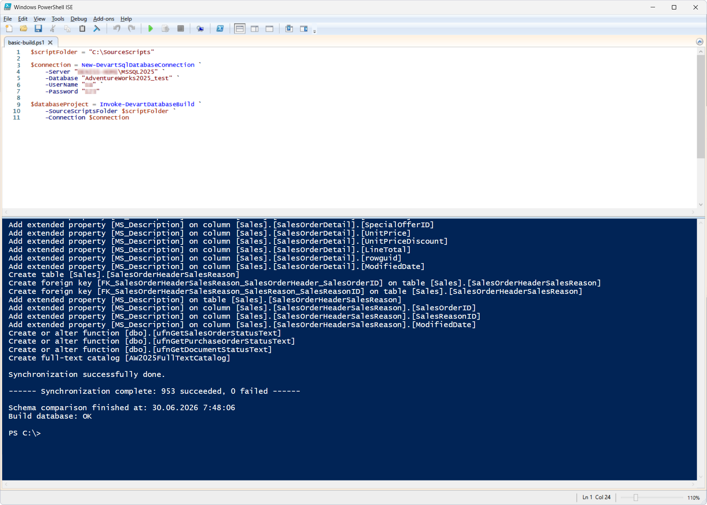
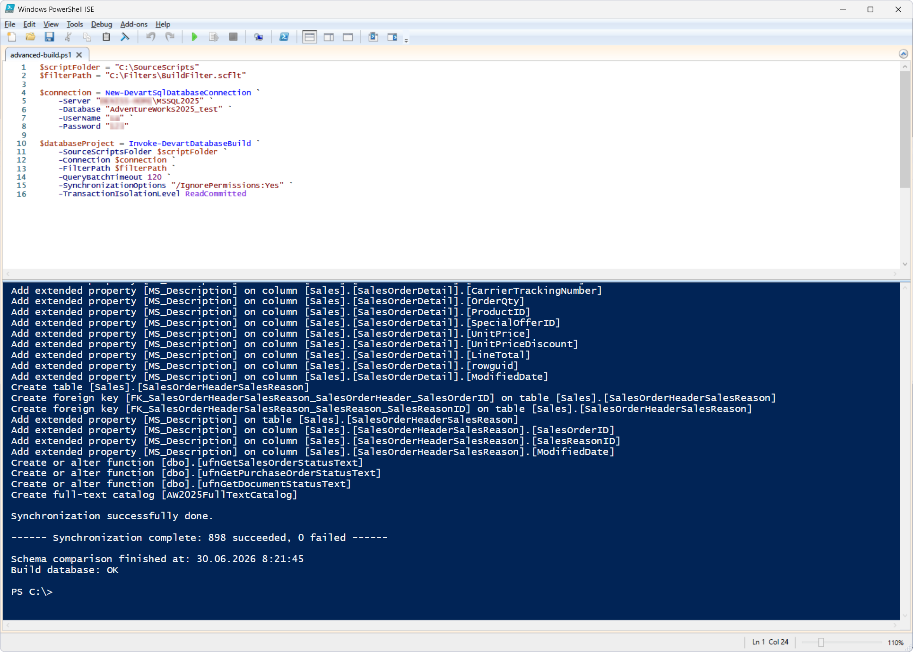

# Invoke-DevartDatabaseBuild

The `Invoke-DevartDatabaseBuild` cmdlet builds a database project from SQL scripts located in the scripts folder and verifies that the schema can be successfully deployed to the target database.

The cmdlet can be used in DevOps processes to:

- Validate the database schema before deployment
- Check that SQL scripts are correct
- Automate CI/CD pipelines
- Catch build errors before changes are published

## Parameters

| Parameter | Required/Optional | Description |
| --- | --- | --- |
| `-SourceScriptsFolder` | Required | Path to the folder with the source SQL scripts (scripts folder) |
| `-Connection` | Required | SQL Server connection object created with `New-DevartSqlDatabaseConnection` or a connection string |
| `-FilterPath` | Optional | Path to the Schema Compare filter file |
| `-QueryBatchTimeout` | Optional | Batch query execution timeout (in seconds) |
| `-SynchronizationOptions` | Optional | Additional Schema Compare options |
| `-TransactionIsolationLevel` | Optional | Transaction isolation level |

## How to use

1. [Prepare a scripts folder](https://docs.devart.com/studio-for-sql-server/database-tasks/create-a-scripts-folder.html) with the SQL scripts of the AdventureWorks2025 database. This example uses the `C:\SourceScripts` folder.
2. Create an **empty** database where the schema will be deployed. This example uses the `AdventureWorks2025_test`.
3. Run the script in PowerShell.

### Basic build

PowerShell script: [`basic-build.ps1`](basic-build.ps1)

After successful execution, the cmdlet creates a database project object (`DatabaseProject`) containing the result of building the schema from SQL scripts in the scripts folder, and confirms that the database structure can be deployed correctly to the target SQL Server instance.

### Advanced build

**Preconditions:**

Set up a Schema Compare filter, for example, exclude views. Save the filter as `BuildFilter.scflt` in the `C:\Filters` folder.

This scenario enables finer control over the build process and can be used in DevOps workflows to:

- Selectively build database objects
- Exclude objects using a filter file
- Configure Schema Compare options
- Control the SQL batch query execution timeout
- Configure the transaction isolation level

PowerShell script: [`advanced-build.ps1`](advanced-build.ps1)

This script creates a database project object (`DatabaseProject`) containing a successfully built and validated database schema based on the SQL scripts from the scripts folder, taking into account the applied filters and additional synchronization options.

## References

For more information, see the [official documentation](https://docs.devart.com/studio-for-sql-server/command-line-automation/devops-automation/powershell-cmdlets/invoke-devartdbbuild.html).
