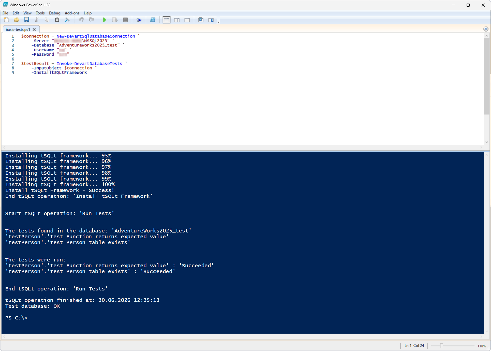
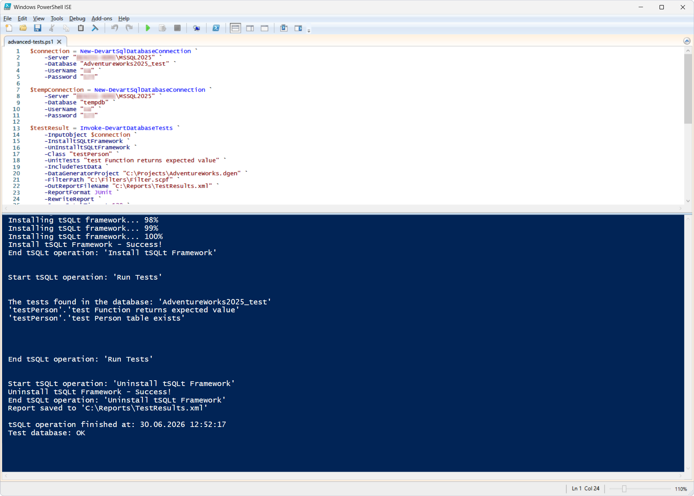

# Invoke-DevartDatabaseTests

The `Invoke-DevartDatabaseTests` cmdlet runs tSQLt unit tests for SQL Server. The input can be a database connection, a scripts folder, or a NuGet package.

The cmdlet can be used in DevOps processes to:

- Automate database unit test runs
- Verify the database logic
- Validate the schema and test data

## Parameters

| Parameter | Required/Optional | Description |
| --- | --- | --- |
| `-InputObject` | Required | Database, scripts folder, or NuGet package to run tests against |
| `-InstalltSQLtFramework` | Optional | Install the tSQLt framework before running the tests |
| `-UnInstalltSQLtFramework` | Optional | Remove the tSQLt framework after completion |
| `-Class` | Optional | Run the tests of the specified test class |
| `-UnitTests` | Optional | Run a specific unit test or test suite |
| `-OutReportFileName` | Optional | Path to the report file |
| `-ReportFormat` | Optional | Report format (JUnit or MsTest) |
| `-RewriteReport` | Optional | Overwrite an existing report |
| `-IncludeTestData` | Optional | Add test data before the test run |
| `-DataGeneratorProject` | Optional | Path to the Data Generator project (`.dgen`) |
| `-FilterPath` | Optional | Path to the Schema Compare filter file |
| `-SynchronizationOptions` | Optional | Additional Schema Compare options |
| `-TemporaryDatabaseServer` | Optional | Connection to a temporary database |
| `-QueryBatchTimeout` | Optional | Batch query execution timeout |

## How to use

1. Prepare a database with unit tests. This example uses the AdventureWorks2025_test database, which is a clone of AdventureWorks2025, with the tSQLt Framework installed.
2. Run the following script to create tests in the AdventureWorks2025_test database.
<details>
  <summary>Click to expand</summary>

  ```sql
-- Remove old tests if they exist
DROP PROCEDURE IF EXISTS testPerson.[test Person table exists];
DROP PROCEDURE IF EXISTS testPerson.[test Function returns expected value];
GO

-- Create test class if not exists
IF NOT EXISTS (
    SELECT 1
    FROM sys.schemas
    WHERE name = 'testPerson'
)
BEGIN
    EXEC tSQLt.NewTestClass 'testPerson';
END
GO

---------------------------------------------------
-- Test 1: Check Person.Person table exists
---------------------------------------------------
CREATE PROCEDURE testPerson.[test Person table exists]
AS
BEGIN
    EXEC tSQLt.AssertObjectExists 'Person.Person';
END
GO

---------------------------------------------------
-- Test 2: Check function returns expected value
---------------------------------------------------
CREATE PROCEDURE testPerson.[test Function returns expected value]
AS
BEGIN
    DECLARE @actual NVARCHAR(100);

    SET @actual = dbo.ufnGetSalesOrderStatusText(1);

    EXEC tSQLt.AssertEqualsString 'In process', @actual;
END
GO
```

</details>

3. Run the script in PowerShell.

### Basic tests

PowerShell script: [`basic-tests.ps1`](basic-tests.ps1)


A successful execution of the cmdlet:

- Installs the tSQLt Framework
- Discovers the available unit tests
- Runs the tests
- Displays the result of each test

The cmdlet returns a boolean value (`True` or `False`) indicating whether the tests passed or failed.

On success, the output contains the message:

`Test database: OK`



### Advanced tests

**Preconditions:**

1. Prepare a Data Generator project (`AdventureWorks.dgen`) and save it to `C:\Projects`.
2. Set up a Schema Compare filter (for example, exclude views). Save the filter as `BuildFilter.scflt` in the `C:\Filters` folder.

PowerShell script: [`advanced-tests.ps1`](advanced-tests.ps1)

This script allows you to:

- Run the tests of a specific test class
- Run individual unit tests
- Generate test data before the test run
- Restrict the set of database objects using a Schema Compare filter
- Generate a test report
- Control Schema Compare options and timeout

A successful execution of the cmdlet:

- Installs the tSQLt framework
- Generates test data
- Applies a Schema Compare filter to restrict the tested objects
- Runs the specified unit test (in the example, "test Function returns expected value")
- Generates a test report in the selected format
- Removes the tSQLt framework after completion (when `-UnInstalltSQLtFramework` is enabled)



## References

For more information, see the [official documentation](https://docs.devart.com/studio-for-sql-server/command-line-automation/devops-automation/powershell-cmdlets/invoke-devartdbtest.html).
