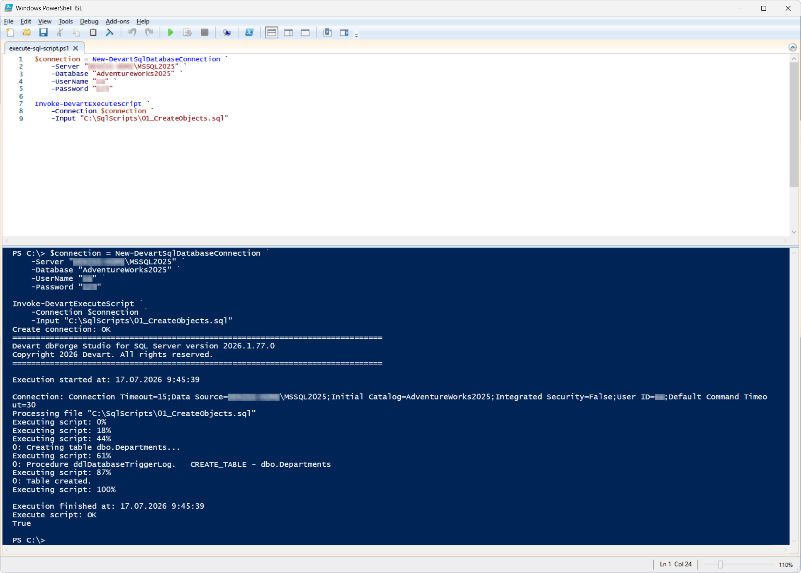
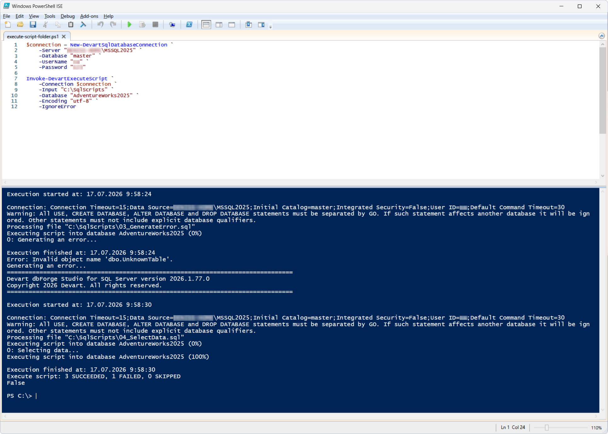

# Invoke-DevartExecuteScript

The `Invoke-DevartExecuteScript` cmdlet runs a SQL script, scripts from a ZIP archive, or all the SQL and ZIP files in the specified folder. When a folder is specified, the scripts run in alphabetical order. Scripts in subfolders are not processed.

The connection is established against the `master` database, while the `-Database` parameter directs script execution to `AdventureWorks2025`, regardless of the database specified in the connection.

## Parameters

| Parameter | Required / Optional | Description |
| --- | --- | --- |
| `-Connection` | Required | SQL Server connection object created with `New-DevartSqlDatabaseConnection` or a connection string |
| `-Input` | Required | Path to a SQL file, a ZIP archive, or a folder containing SQL and ZIP files |
| `-Database` | Optional | Name of the database the scripts will run against; `USE` statements in the scripts are ignored |
| `-Encoding` | Optional | Encoding of SQL files |
| `-ZipPassword` | Optional | Password for the ZIP archive containing scripts |
| `-IgnoreError` | Optional | Execution of the remaining scripts if an error occurs; if `True`, execution continues with the next script when an error occurs, otherwise, execution stops on the first error. |

## How to use

This cmdlet is illustrated with two scenarios.

### Scenario 1: Run a SQL script

This scenario demonstrates executing a single SQL file. 

**Prerequisite:**

Save the following file to `C:\SqlScripts`:

- [`01_CreateObjects.sql`](01_CreateObjects.sql)

PowerShell script: [`execute-sql-script.ps1`](execute-sql-script.ps1)

This script executes the `01_CreateObjects.sql` SQL script. This script runs against the `AdventureWorks2025` database and creates the `dbo.Departments` table.

### Scenario 2: Run all SQL scripts from a folder

This scenario demonstrates running all SQL scripts from a folder with additional options.

**Prerequisites:**

Save the following files to `C:\SqlScripts`:

- [`01_CreateObjects.sql`](01_CreateObjects.sql)
- [`02_InsertData.sql`](02_InsertData.sql)
- [`03_GenerateError.sql`](03_GenerateError.sql)
- [`04_SelectData.sql`](04_SelectData.sql)

PowerShell script: [`execute-script-folder.ps1`](execute-script-folder.ps1)

The cmdlet runs all the SQL files from the `C:\SqlScripts` folder in alphabetical order.

During the run:

- `01_CreateObjects.sql` creates the `dbo.Departments` table
- `02_InsertData.sql` adds test data
- `03_GenerateError.sql` fails because the `dbo.UnknownTable` table does not exist
- `04_SelectData.sql` still runs despite the error in the previous script, because the `-IgnoreError` parameter is used.

## References

For more information, see the [official documentation](https://docs.devart.com/devops-automation-for-sql-server/powershell-cmdlets/invoke-devartexecutescript.html).
