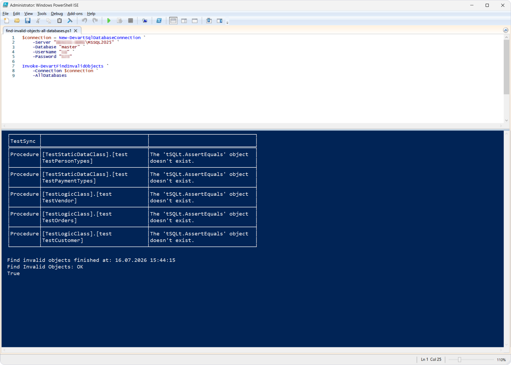
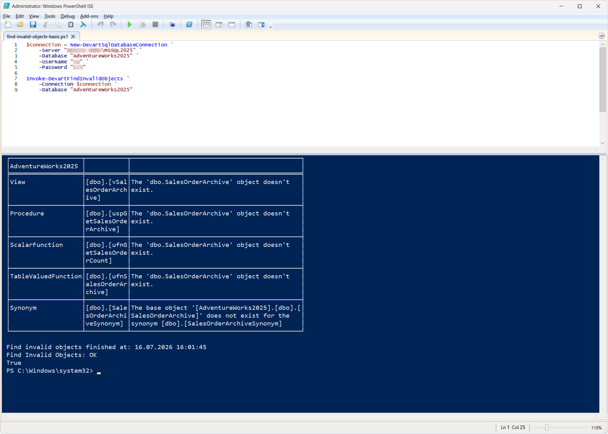
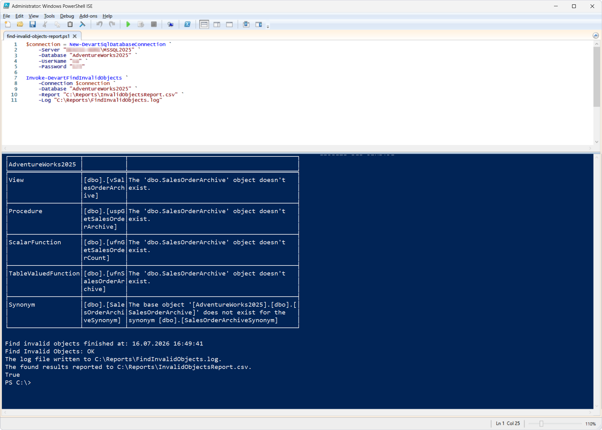

# Invoke-DevartFindInvalidObjects

## Purpose

The `Invoke-DevartFindInvalidObjects` cmdlet searches for invalid objects in one or more SQL Server databases. An object is considered invalid if it contains compilation errors or references to missing objects. Based on the check results, the cmdlet can generate a report in CSV format and an execution log.

This cmdlet can be used in [dbForge Studio for SQL Server](https://www.devart.com/dbforge/sql/studio/) as well as in other database management environments.

## Parameters

| Parameter | Required/Optional | Description |
| --- | --- | --- |
| `-Connection` | Required | SQL Server connection object created with `New-DevartSqlDatabaseConnection` or a connection string |
| `-Database` | Optional | Name of a single database or a comma-separated list of databases |
| `-AllDatabases` | Optional | Checks all user databases on the server. System databases (`master`, `tempdb`, `model`, `msdb`) are excluded. |
| `-Report` | Optional | Path to the CSV file with the check results |
| `-Log` | Optional | Path to the execution log file |

## How to use

Before trying this cmdlet, run the following script against the `AdventureWorks2025` database. The script creates several objects that depend on the `dbo.SalesOrderArchive` table, then drops the table. This makes all dependent objects invalid and provides a realistic test case for the cmdlet.

<details>
<summary>Click to expand</summary>

```sql
USE AdventureWorks2025;
GO

CREATE TABLE dbo.SalesOrderArchive
(
SalesOrderID INT PRIMARY KEY,
CustomerID INT,
OrderDate DATE,
TotalDue MONEY
);
GO

INSERT INTO dbo.SalesOrderArchive
VALUES
(1, 1001, '2025-01-10', 1200),
(2, 1002, '2025-01-15', 850);
GO

CREATE OR ALTER VIEW dbo.vSalesOrderArchive
AS
SELECT *
FROM dbo.SalesOrderArchive;
GO

CREATE OR ALTER PROCEDURE dbo.uspGetSalesOrderArchive
AS
BEGIN
SET NOCOUNT ON;

SELECT *
FROM dbo.SalesOrderArchive;
END
GO

CREATE OR ALTER FUNCTION dbo.ufnGetSalesOrderCount()
RETURNS INT
AS
BEGIN
DECLARE @Count INT;

SELECT @Count = COUNT(*)
FROM dbo.SalesOrderArchive;

RETURN @Count;
END
GO

CREATE OR ALTER FUNCTION dbo.ufnSalesOrderArchive()
RETURNS TABLE
AS
RETURN
(
SELECT *
FROM dbo.SalesOrderArchive
);
GO

IF OBJECT_ID('dbo.SalesOrderArchiveSynonym', 'SN') IS NOT NULL
DROP SYNONYM dbo.SalesOrderArchiveSynonym;
GO

CREATE SYNONYM dbo.SalesOrderArchiveSynonym
FOR AdventureWorks2025.dbo.SalesOrderArchive;
GO

-- Drop the base table to make all dependent objects invalid
-- (this simulates the scenario that Invoke-DevartFindInvalidObjects is designed to detect)
DROP TABLE dbo.SalesOrderArchive;
GO
```
</details>

After using the cmdlet, remove the object created with the script above by running the following script.

<details>
<summary>Click to expand</summary>

```sql
USE AdventureWorks2025;
GO

DROP SYNONYM IF EXISTS dbo.SalesOrderArchiveSynonym;
GO

DROP FUNCTION IF EXISTS dbo.ufnSalesOrderArchive;
GO

DROP FUNCTION IF EXISTS dbo.ufnGetSalesOrderCount;
GO

DROP PROCEDURE IF EXISTS dbo.uspGetSalesOrderArchive;
GO

DROP VIEW IF EXISTS dbo.vSalesOrderArchive;
GO
-- Note: dbo.SalesOrderArchive was already dropped in the setup script
```
</details>

### Scenario 1: Search for invalid objects across all user databases

This scenario demonstrates checking all user databases on the SQL Server instance.

PowerShell script: [`find-invalid-objects-all-databases.ps1`](find-invalid-objects-all-databases.ps1)

All user databases on the SQL Server instance are checked for invalid objects. If any invalid objects are found, information about them is printed to the console.



### Scenario 2: Search for invalid objects in a single database

This scenario demonstrates checking a single database for invalid objects.

PowerShell script: [`find-invalid-objects-basic.ps1`](find-invalid-objects-basic.ps1)

This cmdlet checks the AdventureWorks2025 database for invalid objects. If any invalid objects are found, information about them is printed to the console.



### Scenario 3: Search for invalid objects in a single database with generation of a report and an execution log

This scenario demonstrates checking a database while saving the check results to a CSV file and an execution log.

PowerShell script: [`find-invalid-objects-report.ps1`](find-invalid-objects-report.ps1)

This cmdlet checks the AdventureWorks2025 database for invalid objects. The check results are saved to `C:\Reports\InvalidObjectsReport.csv`, and the execution log is saved to `C:\Reports\FindInvalidObjects.log`.



## References

For more information, see the [official documentation](https://docs.devart.com/devops-automation-for-sql-server/powershell-cmdlets/invoke-devartfindinvalidobjects.html).
