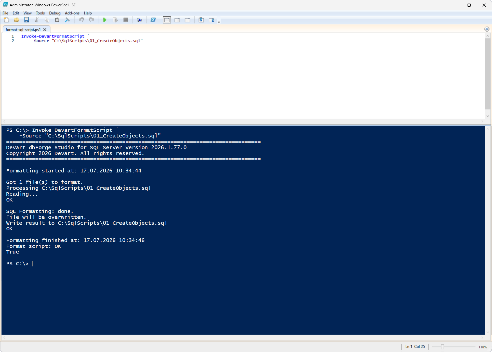
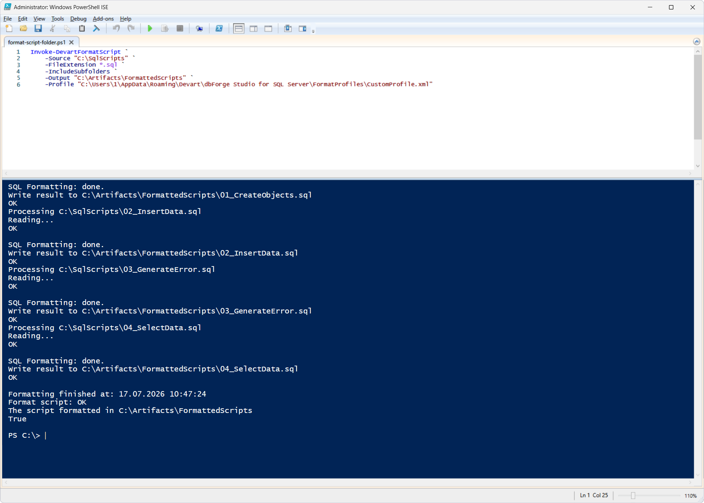

# Invoke-DevartFormatScript

The `Invoke-DevartFormatScript` cmdlet formats a SQL file, or all SQL files in the specified folder, according to the selected formatting profile. The active formatting profile is used by default. If the `-Output` parameter is not specified, the source files are overwritten.

## Parameters

| Parameter | Required/Optional | Description |
| --- | --- | --- |
| `-Source` | Required | Path to a SQL file or a folder containing SQL files |
| `-Connection` | Required | SQL Server connection object created with `New-DevartSqlDatabaseConnection` or a connection string |
| `-Encoding` | Optional | Encoding used when reading and saving files |
| `-FileExtension` | Optional | Extension of the files to format; defaults to `*.sql` |
| `-IncludeSubfolders` | Optional | Search for SQL files also in subfolders |
| `-Output` | Optional | Path to the output file or folder to save the formatting results to; if not specified, each source file is overwritten |
| `-Profile` | Optional | Path to the XML file containing a formatting profile; if not specified, the active formatting profile is used |

## How to use

This cmdlet is illustrated with two scenarios.

**Prerequisites:**

1. Save the following files to `C:\SqlScripts`:
   - [`01_CreateObjects.sql`](01_CreateObjects.sql)
   - [`02_InsertData.sql`](02_InsertData.sql)
   - [`03_GenerateError.sql`](03_GenerateError.sql)
   - [`04_SelectData.sql`](04_SelectData.sql)

2. In dbForge Studio for SQL Server, create a formatting profile named `CustomProfile`.

### Scenario 1: Format a SQL file

This scenario demonstrates formatting a single SQL file.

PowerShell script: [`format-sql-script.ps1`](format-sql-script.ps1)

The `01_CreateObjects.sql` file is formatted according to the active formatting profile.

### Scenario 2: Format all SQL files in a folder

This scenario demonstrates formatting all SQL files in a folder using additional options. It uses formatting profiles stored in dbForge Studio for SQL Server. If you are using dbForge Studio as part of dbForge Edge, update the `-Profile` parameter accordingly.

PowerShell script: [`format-script-folder.ps1`](format-script-folder.ps1)

All SQL files with the `.sql` extension in the `C:\SqlScripts` folder and its subfolders are formatted using the specified formatting profile and saved to `C:\Artifacts\FormattedScripts`. The source files remain unchanged.

## References

For more information, see the [official documentation](https://docs.devart.com/devops-automation-for-sql-server/powershell-cmdlets/invoke-devartformatscript.html).
