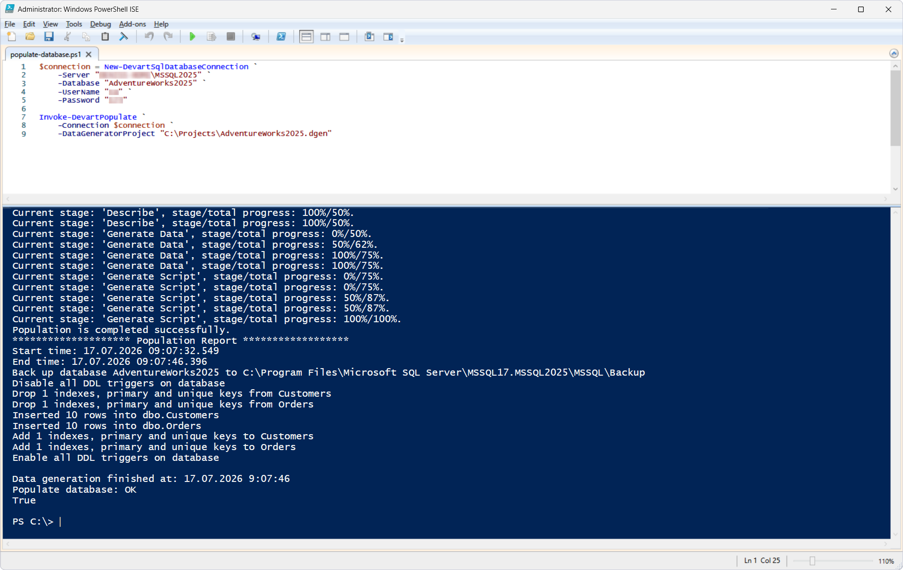

# Invoke-DevartPopulate

The `Invoke-DevartPopulate` cmdlet populates a database with test data using a [dbForge Data Generator](https://www.devart.com/dbforge/sql/studio/sql-server-data-generator.html) project (`*.dgen`). The data generation project contains generation settings, table population rules, and other options that define the data generation process.

## Parameters

| Parameter | Required/Optional | Description |
| --- | --- | --- |
| `-Connection` | Required | SQL Server connection object created with `New-DevartSqlDatabaseConnection` or a connection string |
| `-DataGeneratorProject` | Required | Path to the data generation project (`*.dgen`) |

## How to use

> Before running the example, create a data generation project (`*.dgen`) in the all-in-one AI-powered IDE - [dbForge Studio for SQL Server](https://www.devart.com/dbforge/sql/studio/sql-server-data-generator.html) or [dbForge Data Generator for SQL Server](https://www.devart.com/dbforge/sql/data-generator/). This example uses the project `C:\Projects\AdventureWorks2025.dgen`.

This cmdlet is illustrated with a basic scenario.

This scenario demonstrates the execution of a data generation project.

PowerShell script: [`populate-database.ps1`](populate-database.ps1)

As a result, the `AdventureWorks2025` database is populated with test data according to the settings of the `AdventureWorks2025.dgen` project.

## References

For more information, see the [official documentation](https://docs.devart.com/devops-automation-for-sql-server/powershell-cmdlets/Invoke-DevartPopulate.html).
