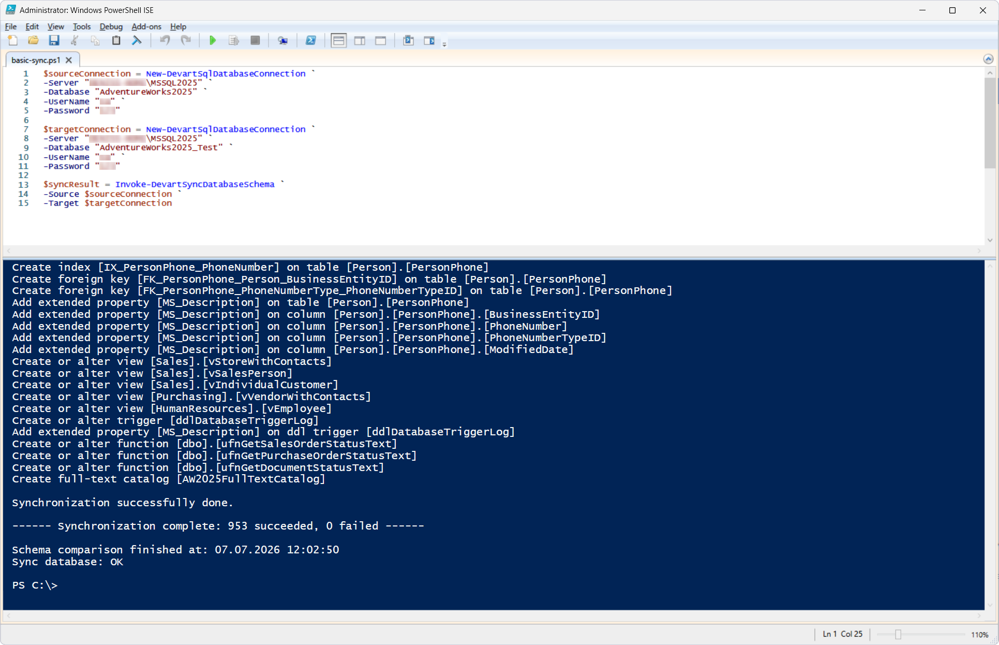
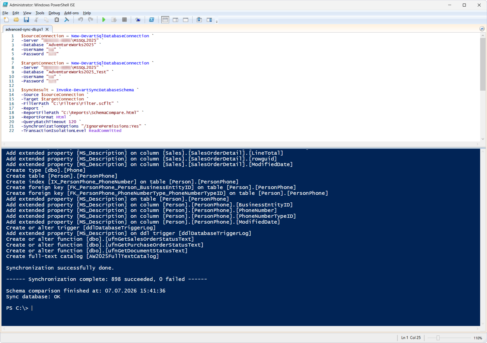
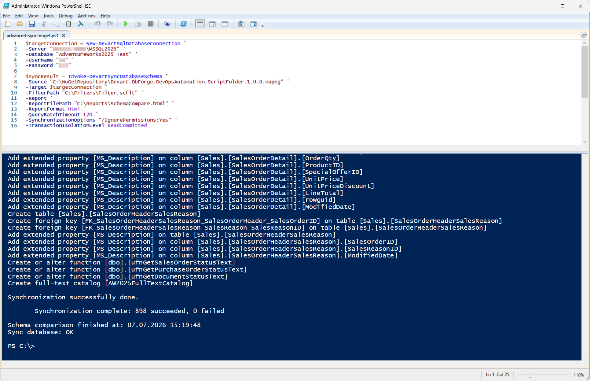

# Invoke-DevartSyncDatabaseSchema

The `Invoke-DevartSyncDatabaseSchema` cmdlet compares the schemas of a source and a target database (or other supported sources) and automatically synchronizes the target schema with the source.

The cmdlet can be used in DevOps processes to automatically deploy schema changes across different environments (Development, Test, Staging, Production), and to synchronize a database with a SQL scripts folder or a NuGet package.

## Parameters

| Parameter | Required/Optional | Description |
| --- | --- | --- |
| `-Source` | Required | Source database: a SQL Server connection object created with `New-DevartSqlDatabaseConnection` or a connection string, a scripts folder, or a NuGet package |
| `-Target` | Required | Target database: a SQL Server connection object created with `New-DevartSqlDatabaseConnection` or a connection string |
| `-FilterPath` | Optional | Path to a Schema Compare filter file (`.scflt`) that defines the objects included in the synchronization |
| `-QueryBatchTimeout` | Optional | Maximum execution time for a single SQL batch (in seconds) |
| `-Report` | Optional | Switch parameter; enables schema comparison report generation |
| `-ReportFilePath` | Optional | Path to save the report to |
| `-ReportFormat` | Optional | Report format (`Html`, `Xls`, `Xml`, `XmlForExcel`) |
| `-SynchronizationOptions` | Optional | Additional Schema Compare options, for example, `IgnoreSemicolons`, `MappingIgnoreCase`, `IgnoreForeignKeys`, etc. |
| `-TransactionIsolationLevel` | Optional | Transaction isolation level used during synchronization (`Serializable`, `Snapshot`, `RepeatableRead`, `ReadCommitted`, `ReadUncommitted`) |

## How to use

**Prerequisites**

Before running the cmdlet:

- Prepare the source and target SQL Server databases, or other supported schema sources and targets (for example, a scripts folder or a NuGet package)
- Create connection objects using the `New-DevartSqlDatabaseConnection` cmdlet
- If necessary, prepare additional files:
  - A Schema Compare filter file (.scflt) to restrict the objects included in the synchronization. The filter file is generated in [dbForge Studio for SQL Server](https://www.devart.com/dbforge/sql/studio/sql-server-schema-compare.html) during a schema comparison.
  - A folder to save the schema comparison report to
- If needed, specify additional synchronization options, such as the report format, Schema Compare options, transaction isolation level, and SQL command timeout

### Basic scenario

PowerShell script: [`basic-sync.ps1`](basic-sync.ps1)

This example synchronizes the schemas of two SQL Server databases.

The execution of this cmdlet automatically synchronizes the schema of the `AdventureWorks2025_Test` database with the schema of the `AdventureWorks2025` database.

### Advanced scenario (between two databases with configured options)

PowerShell script: [`advanced-sync-db.ps1`](advanced-sync-db.ps1)

This example synchronizes the schemas of two databases using an object filter, generates an HTML report, uses an increased timeout for SQL command execution, applies additional synchronization options, and sets a transaction isolation level.

Running the cmdlet synchronizes the schema of the `AdventureWorks2025_Test` database with the schema of the `AdventureWorks2025` database, taking into account the settings specified in the `Filter.scflt` filter file.

After the synchronization, a schema comparison report in the HTML format is generated and saved to `C:\Reports\SchemaCompare.html`. The execution uses additional synchronization options, an increased SQL command timeout, and the `ReadCommitted` transaction isolation level.

### Advanced scenario (with a NuGet package as a source)

PowerShell script: [`advanced-sync-nuget.ps1`](advanced-sync-nuget.ps1)

This example synchronizes the schema of a NuGet package with a target database using an object filter, generates an HTML report, uses an increased timeout for SQL command execution, applies additional synchronization options, and sets a transaction isolation level.

The cmdlet synchronizes the schema of the `AdventureWorks2025_Test` database with the schema contained in the `Devart.DbForge.DevOpsAutomation.ScriptFolder.1.0.0.nupkg` NuGet package, taking into account the settings specified in the `Filter.scflt` filter file.

After the synchronization, a schema comparison report in the HTML format is generated and saved to `C:\Reports\SchemaCompare.html`. The execution uses additional synchronization options, an increased SQL command timeout, and the `ReadCommitted` transaction isolation level.

## References

For more information, see the [official documentation](https://docs.devart.com/studio-for-sql-server/command-line-automation/devops-automation/powershell-cmdlets/invoke-devartsyncdatabaseschema.html).
