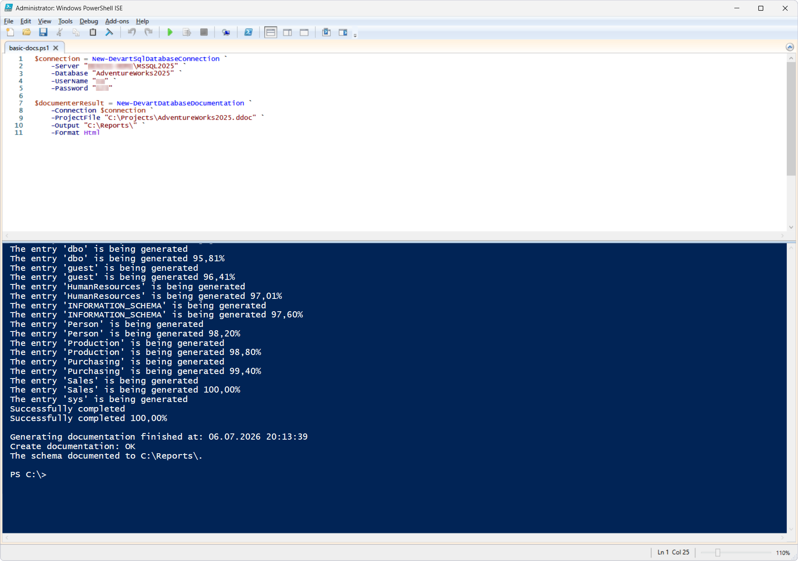
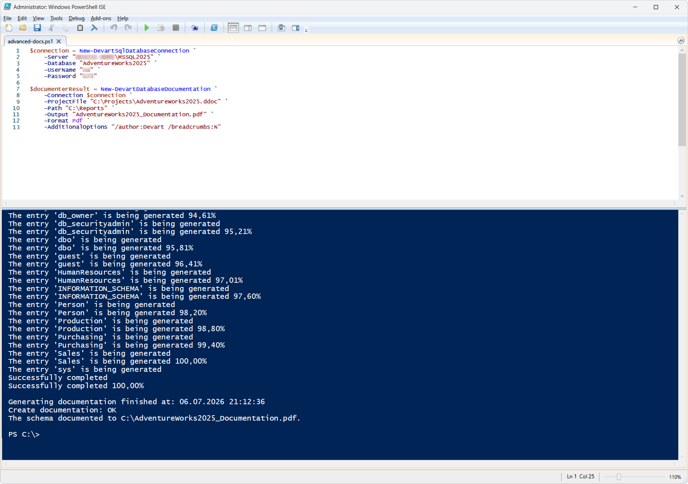

# New-DevartDatabaseDocumentation

The `New-DevartDatabaseDocumentation` cmdlet generates documentation for a specified SQL Server database. The documentation can be generated in HTML, PDF, or Markdown using a Documenter project (`.ddoc`) and additional generation options.

The cmdlet can be used in DevOps processes to automatically generate database documentation, prepare technical documentation, and automate the documentation process at various stages of database development and maintenance.

## Parameters

| Parameter | Required/Optional | Description |
| --- | --- | --- |
| `-Connection` | Required | SQL Server connection object created with `New-DevartSqlDatabaseConnection` or a connection string |
| `-ProjectFile` | Required | Path to a Documenter project (`.ddoc`) |
| `-Output` | Required | Name of the output file (PDF) or folder (HTML/Markdown) |
| `-Path` | Optional | Directory to save the documentation to |
| `-Format` | Required | Documentation format (`Html`, `Pdf`, or `Markdown`) |
| `-AdditionalOptions` | Optional | Additional documentation generation [options](https://docs.devart.com/documenter-for-sql-server/using-the-command-line/switches-used-in-the-command-line.html) |

## How to use

Before running the cmdlet:

1. Create or open a Documenter project (`.ddoc`) for the `AdventureWorks2025` database in the all-in-one AI-powered IDE - [dbForge Studio for SQL Server](https://www.devart.com/dbforge/sql/studio/features.html#documenter) or [dbForge Documenter for SQL Server](https://www.devart.com/dbforge/sql/documenter/).
2. If necessary, specify the documentation format and any additional generation options.

### Basic scenario

PowerShell script: [`basic-docs.ps1`](basic-docs.ps1)

The cmdlet generates database documentation in HTML format in the specified folder.

### Advanced scenario

PowerShell script: [`advanced-docs.ps1`](advanced-docs.ps1)

The cmdlet creates a PDF file with the documentation for the `AdventureWorks2025` database in the `C:\Reports` folder. The documentation is generated from the `AdventureWorks2025.ddoc` project, with Devart specified as the author and breadcrumb navigation disabled.

## References

For more information, see the [official documentation](https://docs.devart.com/studio-for-sql-server/command-line-automation/devops-automation/powershell-cmdlets/new-devartdbdocumentation.html).
