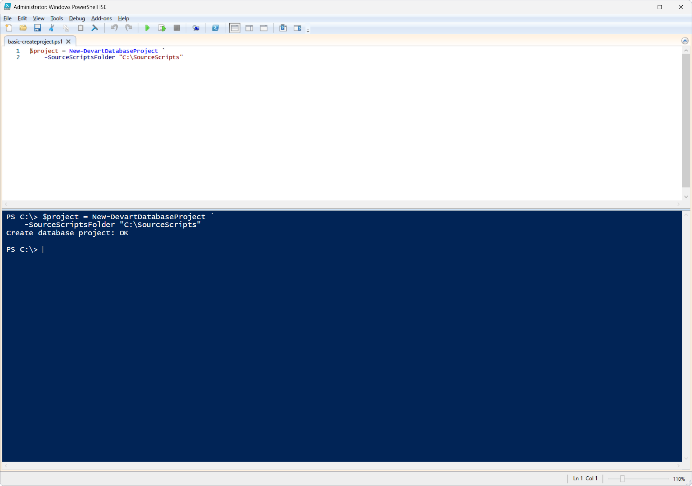

# New-DevartDatabaseProject

The `New-DevartDatabaseProject` cmdlet creates and returns a database project object (`DatabaseProject`) built from the SQL scripts located in a database source scripts folder.

The resulting project object is used by other DevOps Automation cmdlets to perform various operations on the database project, including build, export, and publish.

The cmdlet itself does not build, export, or publish the project. It only creates the database project object, which is then passed to other DevOps Automation cmdlets.

## Parameters

| Parameter | Required/Optional| Description |
| --- | --- | --- |
| `-SourceScriptsFolder` | Required | Path to the folder (scripts folder) containing the source SQL scripts the project object is built from |

## How to use

PowerShell script: [`basic-createproject.ps1`](basic-createproject.ps1)

This cmdlet creates a database project object (`DatabaseProject`) from the SQL scripts located in the `C:\SourceScripts` folder. It can then be used by other DevOps Automation cmdlets to perform operations on the database project.

## References

For more information, see the [official documentation](https://docs.devart.com/devops-automation-for-sql-server/powershell-cmdlets/new-devartdatabaseproject.html).
