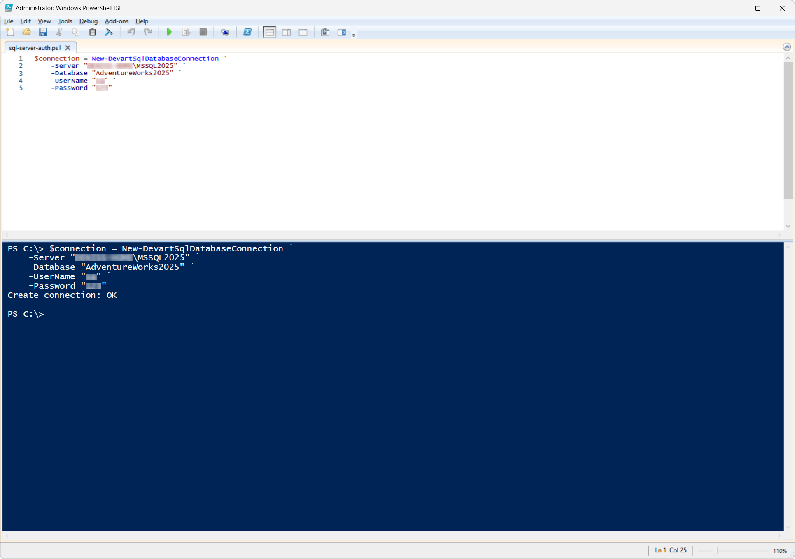
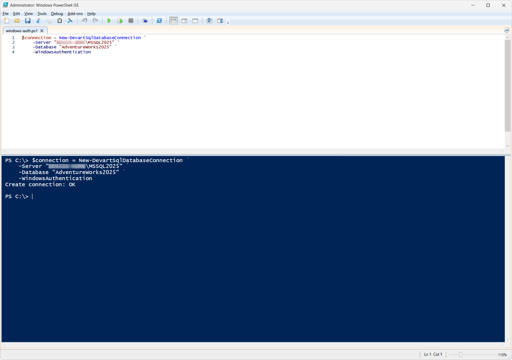

# New-DevartSqlDatabaseConnection

The `New-DevartSqlDatabaseConnection` cmdlet creates and returns a connection object (`DevartDatabaseConnectionInfo`) used by other DevOps Automation cmdlets to perform database operations.

The cmdlet itself does not establish a connection to the server. It only creates a connection object with the specified parameters, which is then passed to other DevOps Automation cmdlets through the `-Connection` parameter.

This object can be used by any DevOps Automation cmdlet that supports the `-Connection` parameter.

## Parameters

| Parameter | Required/Optional | Description |
| --- | --- | --- |
| `-Server` | Required | SQL Server name |
| `-Database` | Required | Database name |
| `-UserName` | Required | SQL Server Authentication user name; not required for `WindowsAuthentication` |
| `-Password` | Required | SQL Server Authentication password; not required for `WindowsAuthentication` |
| `-WindowsAuthentication` | Optional | Use Windows Authentication instead of SQL Server Authentication |

## How to use

### Scenario 1: Create a connection using SQL Server Authentication

PowerShell script: [`sql-server-auth.ps1`](sql-server-auth.ps1)

As a result, a connection object for the `AdventureWorks2025` database is created.

This object does not open a connection to the server by itself; it is used as an input parameter for other DevOps Automation cmdlets.

### Scenario 2: Create a connection using Windows Authentication

PowerShell script: [`windows-auth.ps1`](windows-auth.ps1)

This cmdlet creates a connection object for the `AdventureWorks2025` database using the credentials of the current Windows user.

## References

For more information, see the [official documentation](https://docs.devart.com/devops-automation-for-sql-server/powershell-cmdlets/new-devartsqldatabaseconnection.html).
