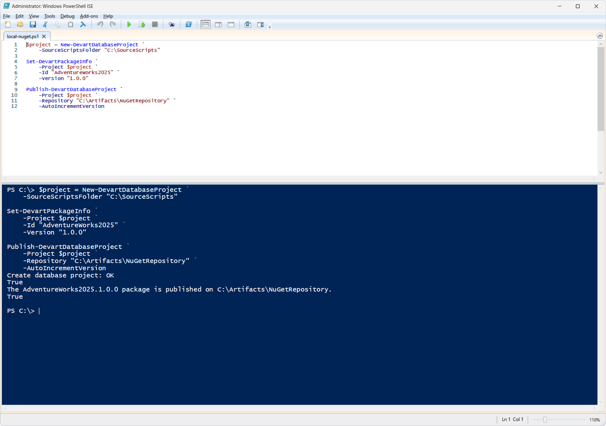
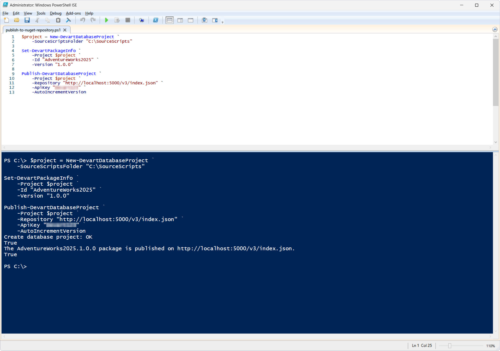

# Publish-DevartDatabaseProject

The `Publish-DevartDatabaseProject` cmdlet publishes a database project (`DatabaseProject`) or a prepared NuGet package to the specified NuGet repository. The version and identifier of the NuGet package to be published are defined with the `Set-DevartPackageInfo` cmdlet.

If a `DatabaseProject` object is used for publishing, the cmdlet can automatically increment the package version if a package with the specified version already exists in the repository.

## Parameters

| Parameter | Required/Optional | Description |
| --- | --- | --- |
| `-Project` | Required | `DatabaseProject` object or path to the NuGet package (`.nupkg`) to publish |
| `-Id` | Required | Unique identifier of the package to be created |
| `-Version` | Optional | Package version |
| `-Repository` | Required | URL or local path to the NuGet repository to which the package will be published |
| `-ApiKey` | Optional | API key used to authenticate when publishing the package to the NuGet repository; required for remote repositories |
| `-AutoIncrementVersion` | Optional | Automatic increment of the package version if a package with the specified version already exists in the repository; used only when publishing a `DatabaseProject` object |

## How to use

### Scenario 1: Publish a DatabaseProject object to a local NuGet repository

PowerShell script: [`local-nuget.ps1`](local-nuget.ps1)

This cmdlet creates a database project object, defines the package information, and publishes it to a local NuGet repository.

If a package with the specified version already exists, the package version is automatically incremented.

### Scenario 2: Publish a DatabaseProject to a NuGet repository

PowerShell script: [`publish-to-nuget-repository.ps1`](publish-to-nuget-repository.ps1)

This cmdlet publishes the NuGet package to the NuGet repository specified in the `-Repository` parameter.

## References

For more information, see the [official documentation](https://docs.devart.com/devops-automation-for-sql-server/powershell-cmdlets/publish-devartdatabaseproject.html).
