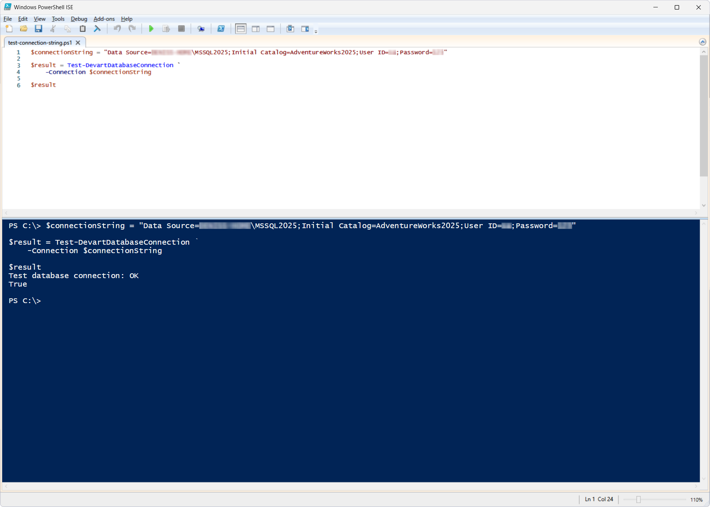
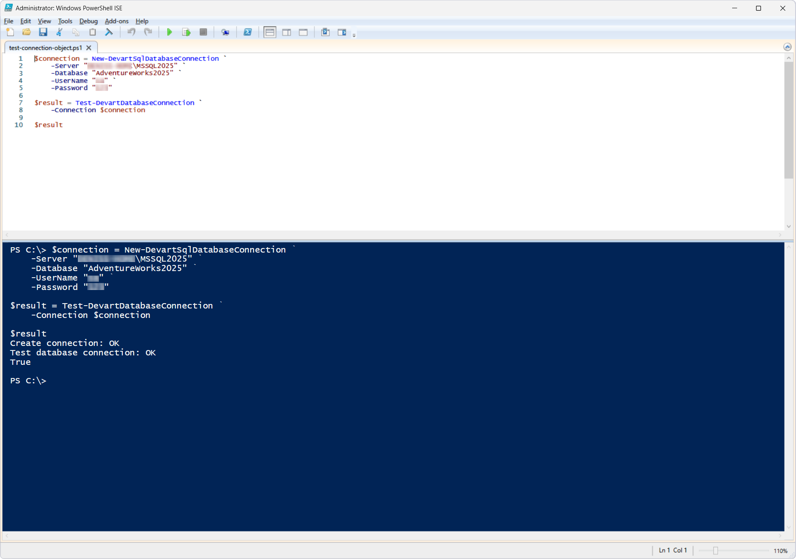
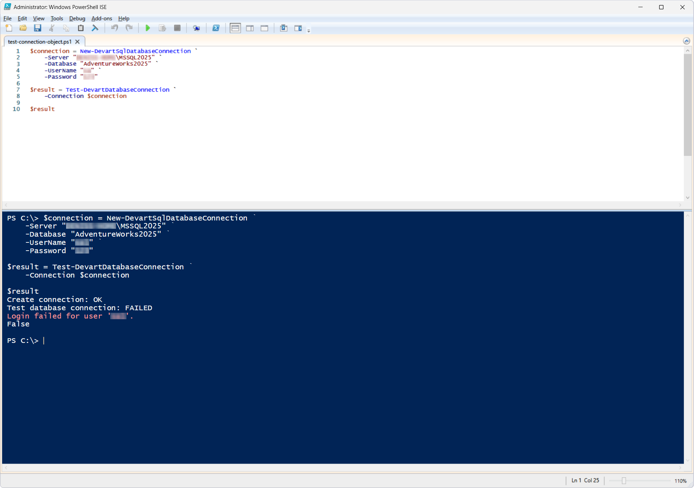

# Test-DevartDatabaseConnection

The `Test-DevartDatabaseConnection` cmdlet checks whether a database connection can be established, using either a connection object (`DevartDatabaseConnectionInfo`) or a connection string.

If the connection is successful, the cmdlet returns `True`. If the connection fails, the cmdlet returns `False` and displays an error message.

## Parameters

| Parameter | Required/Optional | Description |
| --- | --- | --- |
| `-Connection` | Required | SQL Server connection object created with `New-DevartSqlDatabaseConnection` or a connection string |

## How to use

### Scenario 1: Test a connection using a connection string

This scenario demonstrates testing the connection to the `AdventureWorks2025` database using a connection string.

PowerShell script: [`test-connection-string.ps1`](test-connection-string.ps1)

On a successful connection, the cmdlet returns the value `True`.

### Scenario 2: Test a connection using a connection object

This scenario demonstrates creating a connection object with the `New-DevartSqlDatabaseConnection` cmdlet and then testing whether the database connection can be established.

PowerShell script: [`test-connection-object.ps1`](test-connection-object.ps1)

On a successful connection, the cmdlet returns the value `True`.

If the connection fails, the cmdlet returns `False` and displays a message with the reason for the failure. 

## References

For more information, see the [official documentation](https://docs.devart.com/devops-automation-for-sql-server/powershell-cmdlets/test-devartdatabaseconnection.html).
